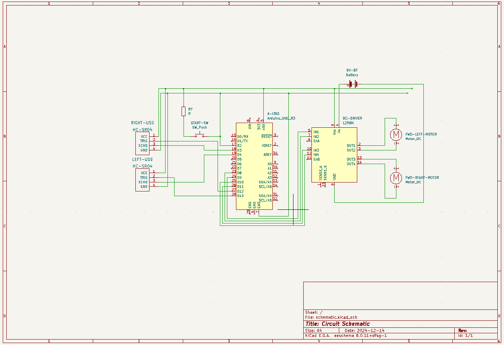

# Self Parking Toy Car

## Introduction

The project consists of a toy car that, when placed in the general direction of a a parking space, it will try to steer itself into said parking space. A parking space is determined by three obstacles and an opening, i.e two parked cars and a wall. The car will use two ultrasonic sensors to measure the distance on its front left and front right and determine whether it is approaching an obstacle and in which direction. With that information, it will try to steer itself away from said obstacle. It will consider the parking maneuver finished once it gets close enough to the wall (which is determined by both sensors reporting similar distances).

## General Description

## Hardware Design

Element|Quantity|Source
---|---|---
DC Motor|2|Faculty
SR90 Servo|1|Bought
L298N|1|Bought
HC-SR04|2|Faculty
Arduino Uno|1|Faculty
1.5V Battery Driver|1|Faculty
1.5V Battery|4|Bought
9V Battery|1|Bought

Roluri Pini:
- D0: Este conectat la push button-ul care comuta masina intre modul parcare si modul standby.
- D1: Este conectat la senzorul ultrasonic din dreapta.
- D4: Este conectat la senzorul ultrasonic din stanga.
- D6: Comunica prin PWM sa controleze unghiul servomotorului care vireaza axul frontal.
- D10-D11: Pinii analogici controleaza viteza motoarelor, conectate la puntea H dubla pentru ambele servo-motoare.
- A0: Primeste semnalul de echo de la senzorul ultrasonic din stanga.
- A1: Primeste semnalul de echo de la senzorul ultrasonic din dreapta.

## Software Design

## Documented Results

## Conclusion

## Biography

- [HC-SR04 Datasheet](https://cdn.sparkfun.com/datasheets/Sensors/Proximity/HCSR04.pdf)
- [L298N Datasheet](https://www.st.com/resource/en/datasheet/l298.pdf)
- [Arduino Technical Details](https://www.oreilly.com/library/view/arduino-a-technical/9781491934319/ch04.html)
